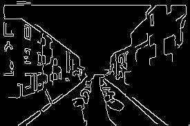

# Basic Image Processing with OpenCV

## Project Overview

This project shows how to do basic image processing using Python and OpenCV.

We performed the following tasks on an image:

1. Grayscale - Converts the image to black and white.
2. Blur - Applies a smoothing effect using Gaussian Blur.
3. Edge Detection - Detects edges using the Canny method.

## How to Use

### Requirements

- Python 3.8 to 3.10
- OpenCV library

### Install OpenCV

Use this command to install OpenCV:

```
pip install opencv-python
```

### Run the Script

1. Put your image in the same folder as the Python file.
2. Name the script file `task1_image_processing.py`.
3. Open a terminal or command prompt in that folder.
4. Run this command:

```
python task1_image_processing.py
```

5. After running the script, you will get 3 new images:
   ## Sample Outputs

## Sample Outputs

### Grayscale Image


### Blurred Image


### Canny Edge Detection



## Output Files

| Task              | Output File Name    |
| ----------------- | ------------------- |
| Grayscale         | grayscale_image.jpg |
| Gaussian Blur     | blurred_image.jpg   |
| Canny Edge Detect | canny_edges.jpg     |

The output images will be saved in the same folder as the script.
i have put the images on the project file as outcomes.

## Tools Used

- Python
- OpenCV

## Author

Sarbagya Neupane  
Email: sarbagyaneupane561@gmail.com
